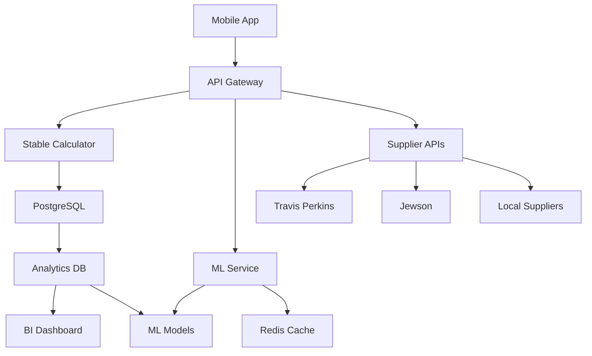

# Post-MVP Accuracy Improvement Strategy

## Executive Summary

This document outlines a systematic approach to continuously improve pricing accuracy after MVP launch, using real-world data collection, feedback loops, and machine learning.

## Current State (MVP)

### ✅ What We Have

- **Stable server-side calculations** with consistent quantities
- **UK building standard ratios** for material requirements
- **Three quality tiers** (budget/standard/premium)
- **Regional price adjustments** (London +15%, etc.)
- **Tool hire pricing** from National Average + Toddy Tool Hire

### ⚠️ Current Limitations

- Material costs ~30-40% lower than real quotes
- Labor estimates based on simple formulas
- No seasonal adjustments
- Limited supplier data
- No historical project tracking

## Phase 1: Data Collection Infrastructure (Months 1-3)

### 1.1 Quote Comparison System

**Implementation:**

```typescript
interface QuoteComparison {
  projectId: string;
  ourEstimate: {
    materials: number;
    labor: number;
    total: number;
  };
  actualQuotes: Array<{
    contractor: string;
    materials: number;
    labor: number;
    total: number;
    date: Date;
  }>;
  variance: {
    materials: number; // % difference
    labor: number;
    total: number;
  };
}
```

**User Flow:**

1. User gets AskToddy estimate
2. Prompt: "Got real quotes? Help us improve!"
3. Simple form to enter contractor quotes
4. Automatic variance calculation
5. Thank you + discount/credit reward

### 1.2 Project Outcome Tracking

**Track actual project costs:**

```sql
CREATE TABLE project_outcomes (
  id UUID PRIMARY KEY,
  user_id UUID,
  initial_estimate JSONB,
  actual_costs JSONB,
  completion_date DATE,
  feedback TEXT,
  accuracy_score DECIMAL(3,2)
);
```

**Data Points to Collect:**

- Initial estimate vs final cost
- Timeline estimate vs actual duration
- Unexpected costs encountered
- Regional price variations
- Seasonal price changes

### 1.3 Supplier Integration

**Priority Integrations:**

1. **Travis Perkins API** - Materials pricing
2. **Jewson** - Trade pricing
3. **Wickes** - DIY pricing
4. **Local Suppliers** - Via partnerships

**Data Structure:**

```typescript
interface SupplierPrice {
  supplier: string;
  material: string;
  price: number;
  unit: string;
  location: string;
  date: Date;
  availability: 'in_stock' | 'order' | 'out_of_stock';
}
```

## Phase 2: Machine Learning Enhancement (Months 3-6)

### 2.1 Price Prediction Model

**Training Data:**

```python
features = [
  'material_type',
  'quantity',
  'location',
  'season',
  'supplier',
  'quality_tier',
  'order_size',
  'delivery_distance'
]

target = 'actual_price'
```

**Model Architecture:**

- Start with Random Forest for interpretability
- Gradient Boosting for better accuracy
- Neural network for complex patterns

### 2.2 Dynamic Adjustment System

```typescript
class PriceAdjustmentEngine {
  adjustPrice(basePrice: number, context: Context): number {
    const adjustments = {
      seasonal: this.getSeasonalFactor(context.date),
      regional: this.getRegionalFactor(context.location),
      demand: this.getDemandFactor(context.materialType),
      bulk: this.getBulkDiscount(context.quantity),
      supplier: this.getSupplierFactor(context.supplier),
    };

    return basePrice * Object.values(adjustments).reduce((acc, val) => acc * val, 1);
  }
}
```

### 2.3 Confidence Scoring

**Implement confidence levels:**

```typescript
interface PriceConfidence {
  level: 'high' | 'medium' | 'low';
  score: number; // 0-100
  factors: {
    dataAge: number;
    sampleSize: number;
    variance: number;
    supplierCount: number;
  };
}
```

## Phase 3: Advanced Features (Months 6-12)

### 3.1 Real-Time Market Data

**WebSocket Integration:**

```typescript
// Real-time price updates
socket.on('price_update', data => {
  cache.invalidate(data.material);
  prices.update(data);
  notifyUsers(data.changes);
});
```

### 3.2 Predictive Analytics

**Future Price Prediction:**

- Material cost trends
- Labor availability forecasts
- Seasonal demand patterns
- Economic indicators integration

### 3.3 Contractor Network

**Build contractor marketplace:**

```typescript
interface ContractorProfile {
  id: string;
  specialties: string[];
  averageQuote: number;
  completedProjects: number;
  accuracyScore: number;
  customerRating: number;
}
```

## Implementation Roadmap

### Month 1-2: Foundation

- [ ] Set up analytics database
- [ ] Implement quote comparison UI
- [ ] Create feedback collection system
- [ ] Deploy tracking endpoints

### Month 3-4: Data Collection

- [ ] Launch user incentive program
- [ ] Integrate first supplier API
- [ ] Build admin dashboard
- [ ] Start A/B testing prices

### Month 5-6: ML Development

- [ ] Train initial prediction model
- [ ] Implement confidence scoring
- [ ] Deploy adjustment engine
- [ ] Create accuracy reports

### Month 7-9: Optimization

- [ ] Fine-tune ML models
- [ ] Add more data sources
- [ ] Implement caching layer
- [ ] Optimize performance

### Month 10-12: Scale

- [ ] Launch contractor network
- [ ] Real-time pricing
- [ ] Predictive features
- [ ] Mobile app updates

## Success Metrics

### Accuracy KPIs

| Metric            | Current | 6 Month Target | 12 Month Target |
| ----------------- | ------- | -------------- | --------------- |
| Material Accuracy | 60%     | 80%            | 90%             |
| Labor Accuracy    | 50%     | 70%            | 85%             |
| Total Accuracy    | 55%     | 75%            | 88%             |
| User Trust Score  | -       | 7/10           | 9/10            |

### Business KPIs

- **Quote-to-Project Conversion**: Track how many estimates lead to projects
- **User Retention**: Monthly active users using pricing features
- **Contractor Adoption**: Number of contractors providing quotes
- **Data Coverage**: % of UK regions with accurate data

## Technical Architecture



## Budget Estimation

### Development Costs

- **Phase 1**: £15,000 (3 months, 1 developer)
- **Phase 2**: £25,000 (3 months, 1 developer + 1 data scientist)
- **Phase 3**: £35,000 (6 months, 2 developers)
- **Total**: £75,000

### Infrastructure Costs

- **Databases**: £200/month
- **ML Infrastructure**: £500/month
- **API Integrations**: £300/month
- **Total**: £1,000/month ongoing

### ROI Projection

- **Improved Accuracy**: 20% more conversions
- **Contractor Network**: £50/month per contractor
- **Premium Features**: £10/month per power user
- **Break-even**: Month 8-10

## Risk Mitigation

### Data Quality Risks

- **Mitigation**: Automated validation, outlier detection
- **Backup**: Manual review process for suspicious data

### Supplier Dependency

- **Mitigation**: Multiple supplier integrations
- **Backup**: Crowd-sourced pricing data

### Model Accuracy

- **Mitigation**: A/B testing, gradual rollout
- **Backup**: Fallback to stable calculations

## Conclusion

This strategy transforms AskToddy from a simple estimator to a comprehensive pricing intelligence platform. By systematically collecting data, applying ML, and building a contractor network, we can achieve industry-leading accuracy while creating valuable network effects.

### Quick Wins (Do First)

1. **Quote comparison feature** - Easy to build, immediate value
2. **Travis Perkins API** - Instant accuracy improvement
3. **User feedback system** - Simple implementation, valuable data
4. **Regional multipliers** - Use government data for adjustments

### Next Steps

1. Create Linear tickets for Phase 1 tasks
2. Set up analytics infrastructure
3. Design feedback UI mockups
4. Contact supplier API teams
5. Recruit beta testers for quote comparison
